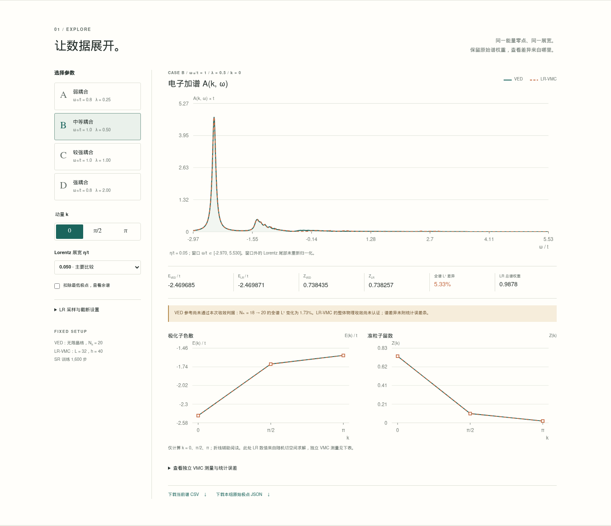

# Holstein model

1D Holstein 极化子的理论结果网站：从已完成的 VED 和 LR-VMC 计算中读取真实数据，交互比较色散、准粒子留数和全频率窗口内的电子加谱。

网站：**<https://rjguo1208.github.io/Holstein-model/>**

公开仓库：<https://github.com/rjguo1208/Holstein-model>。网站源码与可下载结果位于 `site/`。



## 本地浏览

只需 Python 3，无需安装前端依赖或构建：

```bash
cd site
python3 -m http.server 8000 --bind 127.0.0.1
```

打开 <http://localhost:8000>。在远程机器运行时可通过 SSH 转发本地端口；请用 HTTP 预览，因为图表通过 `fetch` 读取 JSON。

## 网站内容

- 参数 A–D，分别为 `(ω₀/t, λ) = (0.8, 0.25), (1, 0.5), (1, 1), (0.8, 2)`。
- 已计算的三个动量 `k = 0, π/2, π`，主展宽 `η/t = 0.025, 0.05`，补充展宽 `0.1, 0.2`。
- 主结果来自 `L=32, h=40` 的随机 SR 训练，以及无限晶格 `Nh=20` 的 VED。
- LR 样本量 `65,536 / 262,144`，度量截断 `10⁻² / 10⁻³ / 10⁻⁴`；两个样本量是同一测量记录的前缀。
- 全谱/最低极点余谱、E(k)、Z(k)、独立 VMC 测量、当前谱 CSV、原始极点 JSON、PDF 谱图和完整报告。

**目前全窗口精度尚未通过。** 能量接近 VED 不代表整个谱收敛，VED 参考谱自身也有截断误差。网站保留原始权重，不平移能量、不强制归一化，也不把三个动量点插值成连续动量扫描。

详见 [实际计算报告](site/reports/RESULTS.md)。报告中的 18 项测试对应原计算程序，与下面的网站数据校验不同。

首版的数值一致性与浏览器检查见 [验证记录](docs/verification.md)。

## 文件结构

```text
site/index.html           中文研究结果主页
site/assets/              样式、交互图表、Lorentz 展宽函数
site/data/                真实极点、独立测量、收敛数据与来源摘要
site/downloads/           固定展示设置的 12 点 CSV 对照
site/reports/             计算报告与可下载图件
scripts/export_holstein.py  从原计算目录重新导出网站数据
scripts/check_site.py       链接、数据完整性与谱矩检查
scripts/check_spectra.mjs    浏览器展宽结果与 Python 计算记录交叉核对
.github/workflows/          自动校验与手动 Pages 部署配置
```

这是网站及结果快照仓库。完整训练样本、检查点和计算引擎保留在原计算项目中；导出脚本不会运行新的物理计算。

## 更新结果

在仓库根目录、包含 NumPy 的 Python ≥ 3.9 环境中：

```bash
python scripts/export_holstein.py /path/to/holstein_lrvmc
python3 scripts/check_site.py
node scripts/check_spectra.mjs
```

导出文件记录原始来源文件的 SHA-256，保留浮点数据精度。网页对全部保存的极点进行 Lorentz 展宽，L¹ 指标采用与计算程序相同的频率网格与梯形积分。

修改研究结论或新增参数后，也应同步更新页面说明。这里的导出器明确对应当前四组参数、三个动量和六档 LR 设置，缺少数据时会报错。

## 部署

`site/` 可由任意静态 HTTP 服务托管，所有本地资源使用相对路径，兼容 `/Holstein-model/` 子路径。没有外部字体、CDN 脚本或后端服务。

仓库已启用 GitHub Pages，发布来源为 **GitHub Actions**。后续更新网站时，推送代码后，从 **Actions** 手动运行 `Deploy GitHub Pages` 工作流。工作流只发布 `site/`，发布前再次运行数据校验；普通推送仅自动触发检查。

当前账号方案要求此仓库公开才能使用 Pages，因此网站与仓库均公开可访问。相关托管规则见 [GitHub 官方说明](https://docs.github.com/en/pages/getting-started-with-github-pages/creating-a-github-pages-site)。

## 方法文献

- [Bonča, Trugman & Batistić, The Holstein Polaron (1999)](https://arxiv.org/abs/cond-mat/9812252)
- [Mahajan et al., Structure and dynamics of electron-phonon coupled systems using neural quantum states (2024)](https://arxiv.org/abs/2405.08701)

本页对应独立实现与首轮基准，不宣称复现文献中的全部模型、网络结构或精度。
