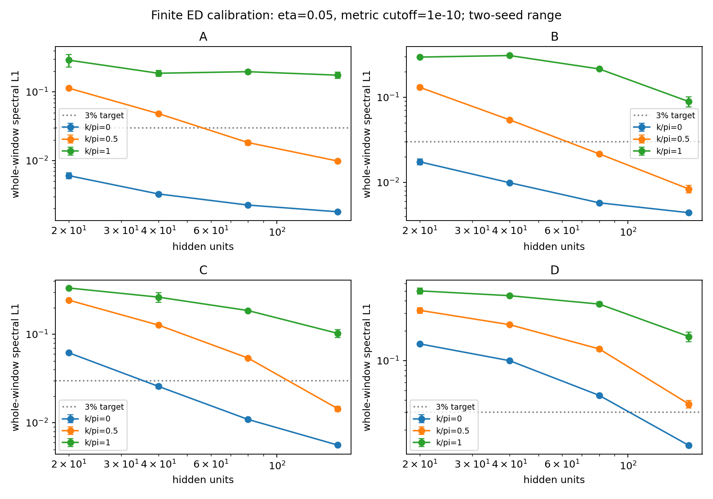

# 实际结果与收敛状态

实现和数值验证已经完成；下列物理比较保留所有未达标项。**当前数据没有证明 LR-VMC 在整个目标频率窗口达到预设精度。**

所有谱权重未经面积归一化，比较不独立平移能量。SR 训练和随机 LR 是两种不同的估计；训练能量接近 VED 不保证 LR 无伪极点。

## VED 参考

| case | k/π | Nh | E/t | Z | 最后两级 ΔE/t | 最后两级全谱 L1，η=0.05 | 全谱参考通过判据 |
|---|---:|---:|---:|---:|---:|---:|---|
| A | 0 | 20 | -2.209464511921 | 0.85340305 | +1.11e-14 | 1.20% | 否 |
| A | 0.5 | 20 | -1.461141636145 | 0.036990586 | +2.36e-05 | 5.32% | 否 |
| A | 1 | 20 | -1.422851865965 | 0.0040962286 | +2.98e-04 | 2.52% | 否 |
| B | 0 | 20 | -2.469684723933 | 0.73843508 | +5.11e-14 | 1.73% | 否 |
| B | 0.5 | 20 | -1.698213218252 | 0.10260243 | +8.69e-09 | 1.92% | 否 |
| B | 1 | 20 | -1.568922355392 | 0.020024379 | +1.40e-06 | 3.33% | 否 |
| C | 0 | 20 | -2.998828186867 | 0.48928652 | +1.23e-13 | 0.45% | 否 |
| C | 0.5 | 20 | -2.515710194008 | 0.081124283 | +9.26e-12 | 0.77% | 否 |
| C | 1 | 20 | -2.391935248435 | 0.024075208 | +5.55e-11 | 1.83% | 否 |
| D | 0 | 20 | -4.324449989933 | 0.043642366 | +3.79e-06 | 15.49% | 否 |
| D | 0.5 | 20 | -4.282181915802 | 0.0077083197 | +5.44e-06 | 30.80% | 否 |
| D | 1 | 20 | -4.268527300882 | 0.0029317109 | +6.07e-06 | 31.22% | 否 |

B、C 的 k=0 能量可与文献逐位检查。A、D 以及 k≠0 使用独立 VED 的逐级变化评估；高能谱仍可能明显依赖生成代数。
[逐级 VED / Lanczos 数值](results/audit/ved_changes.csv)。η=0.025 和余谱误差也在此表中。

## 有限空间的网络容量对照

已完成 96 次全求和能量优化，L=8、总 Nph≤5。它们与同一有限空间的独立 ED 比较，不能替代无限系统结果。
下面固定 seed=0、η=0.05、度量截断 10⁻¹⁰；没有挑选最佳种子。

| case | k/π | h=20 全谱 L1 | h=40 | h=80 | h=160 | h=160 ΔE/t | h=160 ΔZ |
|---|---:|---:|---:|---:|---:|---:|---:|
| A | 0 | 0.66% | 0.33% | 0.23% | 0.19% | +6.13e-08 | +1.64e-07 |
| A | 0.5 | 11.76% | 5.04% | 1.97% | 0.99% | +2.02e-07 | -1.01e-07 |
| A | 1 | 35.16% | 20.48% | 19.17% | 15.69% | +3.99e-07 | -8.46e-08 |
| B | 0 | 1.61% | 0.98% | 0.57% | 0.44% | +2.80e-07 | +5.42e-07 |
| B | 0.5 | 12.40% | 5.48% | 2.10% | 0.75% | +5.12e-07 | +6.93e-08 |
| B | 1 | 30.27% | 31.77% | 20.61% | 7.68% | +1.08e-06 | +1.89e-08 |
| C | 0 | 6.25% | 2.46% | 1.11% | 0.54% | +5.48e-07 | +7.30e-07 |
| C | 0.5 | 24.22% | 12.98% | 5.49% | 1.35% | +1.01e-06 | +3.01e-07 |
| C | 1 | 33.32% | 23.04% | 17.93% | 9.15% | +1.79e-06 | +2.89e-08 |
| D | 0 | 15.23% | 9.66% | 4.60% | 1.42% | +6.93e-07 | +3.45e-07 |
| D | 0.5 | 30.00% | 23.09% | 12.52% | 3.32% | +9.52e-07 | +5.15e-08 |
| D | 1 | 53.89% | 43.45% | 35.20% | 19.42% | +1.28e-06 | +2.80e-08 |

[全部有限空间比较与误差](results/comparison_fullsum/report.md) · [全窗口谱图](results/comparison_fullsum/spectra.pdf) · [E(k)、Z(k)](results/comparison_fullsum/dispersion_residue.pdf)。带宽误差保存在同目录的 `bandwidths.json`。

## 真正的随机 VMC / LR

L=32、h=40，独立多链 SR 训练；没有枚举 Hilbert 空间。下表使用中心化重加权的 262144 个 LR 样本，固定训练 seed=0、采样 seed=2026、η=0.05、度量截断 10⁻³。能量标准误来自独立链均值，尚未包含尺寸与变分误差；谱指标不带已认证误差条。

| case | k/π | VMC E/t ± 链标准误 | VMC ΔE/t | VMC Z ± 链标准误 | LR ΔE/t | LR ΔZ | LR 全谱 L1 |
|---|---:|---:|---:|---:|---:|---:|---:|
| A | 0 | -2.2098472 ± 0.0003 | -0.000383 | 0.847656 ± 0.0029 | -2.03e-05 | +7.63e-05 | 2.42% |
| A | 0.5 | -1.4595935 ± 0.00047 | +0.00155 | 0.0325012 ± 0.0023 | -0.00187 | -0.000166 | 15.72% |
| A | 1 | -1.4213209 ± 0.00047 | +0.00153 | 0.0039978 ± 0.0007 | -0.0718 | -0.000708 | 31.62% |
| B | 0 | -2.4695096 ± 0.00014 | +0.000175 | 0.72879 ± 0.0033 | -0.000187 | -0.000178 | 5.33% |
| B | 0.5 | -1.6966733 ± 0.00077 | +0.00154 | 0.100861 ± 0.0033 | -0.00117 | -0.000406 | 16.10% |
| B | 1 | -1.5657838 ± 0.001 | +0.00314 | 0.0175476 ± 0.0012 | -0.00108 | -0.000178 | 30.57% |
| C | 0 | -2.9987445 ± 0.0011 | +8.37e-05 | 0.495392 ± 0.0048 | -0.000773 | -0.000406 | 19.88% |
| C | 0.5 | -2.5138025 ± 0.00082 | +0.00191 | 0.0859985 ± 0.0027 | -0.00424 | -0.000413 | 32.63% |
| C | 1 | -2.3895584 ± 0.0014 | +0.00238 | 0.0240479 ± 0.00095 | -0.00314 | -0.000224 | 41.52% |
| D | 0 | -4.3226758 ± 0.0012 | +0.00177 | 0.0411377 ± 0.0018 | -0.0034 | -0.000929 | 42.62% |
| D | 0.5 | -4.2777852 ± 0.0018 | +0.0044 | 0.0071106 ± 0.00089 | -0.00433 | -0.000376 | 63.36% |
| D | 1 | -4.2628255 ± 0.0018 | +0.0057 | 0.00338745 ± 0.00043 | -0.00536 | -0.000287 | 68.03% |

[完整随机比较](results/comparison_vmc_centered/report.md) · [全谱图](results/comparison_vmc_centered/spectra.pdf) · [E(k)、Z(k)](results/comparison_vmc_centered/dispersion_residue.pdf)。这份汇总使用最新完成的 VED，且每个 case 的三个 k 使用同一频率窗口。

第一轮 RMS 重加权的 LR 产生了明显伪极点，例如 B、k=0 的最低能量偏低约 0.075t（度量截断 10⁻⁴）；改进前的所有数据仍见 [原始 SR / LR 对照](results/comparison_vmc/report.md)。

最初 Adam 配置在 A、k=π 未访问真空而停止；部分结果保存在 `results/vmc_initial`，不列为完成的收敛数据。当前实现会保存失败记录并继续其他点。

## 固定网络后的独立 LR 采样检查

中心化并按导数方差缩放的重加权目标，独立 pilot 与测量种子。A、k=π 的零 umbrella 首次测量只有 24 次真空访问，前缀仅 6 次，失败记录保存在 `results/lr_resample_Api`。对该点及 D 的后续测量，独立 pilot 将真空目标概率调到约 3%，随后冻结权重；不使用参考能量或谱来调参。两个样本量是同一条测量记录的前缀，**不是独立复现实验**。

| case | k/π | 样本数 | 度量截断 | ΔE/t | ΔZ | 全谱 L1，η=0.05 | 总谱权重 |
|---|---:|---:|---:|---:|---:|---:|---:|
| A | 0 | 65536 | 1e-02 | -9.07e-05 | +0.000831 | 3.81% | 0.989445 |
| A | 0 | 65536 | 1e-03 | -0.000389 | +0.000108 | 2.81% | 0.993916 |
| A | 0 | 65536 | 1e-04 | -0.00176 | -0.00278 | 3.61% | 0.999239 |
| A | 0 | 262144 | 1e-02 | +0.000108 | +0.000339 | 3.77% | 0.989251 |
| A | 0 | 262144 | 1e-03 | -2.03e-05 | +7.63e-05 | 2.42% | 0.994422 |
| A | 0 | 262144 | 1e-04 | -0.000394 | -0.000649 | 1.86% | 0.999180 |
| A | 0.5 | 65536 | 1e-02 | -0.00137 | -0.00206 | 30.18% | 0.908960 |
| A | 0.5 | 65536 | 1e-03 | -0.0105 | +2.24e-05 | 17.52% | 0.978962 |
| A | 0.5 | 65536 | 1e-04 | -0.177 | -0.0367 | 17.25% | 0.990927 |
| A | 0.5 | 262144 | 1e-02 | +0.00107 | -0.00135 | 27.17% | 0.915281 |
| A | 0.5 | 262144 | 1e-03 | -0.00187 | -0.000166 | 15.72% | 0.980026 |
| A | 0.5 | 262144 | 1e-04 | -0.00554 | +0.000154 | 10.41% | 0.989555 |
| A | 1 | 65536 | 1e-02 | -1.13 | -0.00364 | 55.51% | 0.936529 |
| A | 1 | 65536 | 1e-03 | -1.6 | -0.0036 | 38.16% | 0.985213 |
| A | 1 | 65536 | 1e-04 | -4.21 | -0.00408 | 24.05% | 0.998217 |
| A | 1 | 262144 | 1e-02 | -0.0238 | -0.000218 | 68.23% | 0.938304 |
| A | 1 | 262144 | 1e-03 | -0.0718 | -0.000708 | 31.62% | 0.976201 |
| A | 1 | 262144 | 1e-04 | -0.796 | -0.00405 | 22.33% | 0.990964 |
| B | 0 | 65536 | 1e-02 | -0.000453 | -0.000163 | 8.05% | 0.967722 |
| B | 0 | 65536 | 1e-03 | -0.00171 | -0.0021 | 6.55% | 0.987680 |
| B | 0 | 65536 | 1e-04 | -0.00476 | -0.00572 | 8.33% | 0.995185 |
| B | 0 | 262144 | 1e-02 | +0.000153 | +0.00035 | 7.65% | 0.968237 |
| B | 0 | 262144 | 1e-03 | -0.000187 | -0.000178 | 5.33% | 0.987778 |
| B | 0 | 262144 | 1e-04 | -0.000974 | -0.00124 | 4.03% | 0.995260 |
| B | 0.5 | 65536 | 1e-02 | +0.000759 | -0.0025 | 26.15% | 0.920764 |
| B | 0.5 | 65536 | 1e-03 | -0.00707 | -0.00178 | 14.91% | 0.965387 |
| B | 0.5 | 65536 | 1e-04 | -0.0221 | -0.00344 | 13.72% | 0.981633 |
| B | 0.5 | 262144 | 1e-02 | +0.00165 | -0.000792 | 23.26% | 0.920646 |
| B | 0.5 | 262144 | 1e-03 | -0.00117 | -0.000406 | 16.10% | 0.965538 |
| B | 0.5 | 262144 | 1e-04 | -0.00473 | -0.0006 | 8.60% | 0.981339 |
| B | 1 | 65536 | 1e-02 | -0.00178 | -0.000413 | 59.65% | 0.887094 |
| B | 1 | 65536 | 1e-03 | -0.0137 | -0.000274 | 19.56% | 0.964584 |
| B | 1 | 65536 | 1e-04 | -0.0338 | -1.11e-05 | 19.46% | 0.977006 |
| B | 1 | 262144 | 1e-02 | +0.0029 | -0.000256 | 57.10% | 0.886803 |
| B | 1 | 262144 | 1e-03 | -0.00108 | -0.000178 | 30.57% | 0.962966 |
| B | 1 | 262144 | 1e-04 | -0.0054 | -4.23e-05 | 16.61% | 0.975310 |
| C | 0 | 65536 | 1e-02 | -0.00066 | -0.00154 | 23.26% | 0.925497 |
| C | 0 | 65536 | 1e-03 | -0.005 | -0.00503 | 19.88% | 0.965602 |
| C | 0 | 65536 | 1e-04 | -0.016 | -0.0168 | 34.54% | 0.975687 |
| C | 0 | 262144 | 1e-02 | +0.00113 | +0.000459 | 24.66% | 0.924409 |
| C | 0 | 262144 | 1e-03 | -0.000773 | -0.000406 | 19.88% | 0.965319 |
| C | 0 | 262144 | 1e-04 | -0.00366 | -0.0033 | 15.59% | 0.974432 |
| C | 0.5 | 65536 | 1e-02 | -0.00308 | -0.000512 | 49.28% | 0.828287 |
| C | 0.5 | 65536 | 1e-03 | -0.0217 | -0.00237 | 30.45% | 0.908110 |
| C | 0.5 | 65536 | 1e-04 | -0.0525 | -0.00782 | 32.61% | 0.931639 |
| C | 0.5 | 262144 | 1e-02 | +0.00269 | -7.6e-05 | 51.30% | 0.824145 |
| C | 0.5 | 262144 | 1e-03 | -0.00424 | -0.000413 | 32.63% | 0.907402 |
| C | 0.5 | 262144 | 1e-04 | -0.0105 | -0.00138 | 22.81% | 0.929367 |
| C | 1 | 65536 | 1e-02 | -3.99e-05 | -0.00224 | 71.79% | 0.536082 |
| C | 1 | 65536 | 1e-03 | -0.0282 | -0.000738 | 41.89% | 0.842455 |
| C | 1 | 65536 | 1e-04 | -0.0592 | -0.00204 | 37.62% | 0.881299 |
| C | 1 | 262144 | 1e-02 | +0.0074 | -0.00251 | 77.22% | 0.516366 |
| C | 1 | 262144 | 1e-03 | -0.00314 | -0.000224 | 41.52% | 0.833820 |
| C | 1 | 262144 | 1e-04 | -0.0105 | -0.000325 | 38.46% | 0.874026 |
| D | 0 | 65536 | 1e-02 | +0.00236 | -0.00282 | 71.42% | 0.442679 |
| D | 0 | 65536 | 1e-03 | -0.0334 | -0.00513 | 43.38% | 0.726469 |
| D | 0 | 65536 | 1e-04 | -0.0596 | -0.009 | 56.21% | 0.763705 |
| D | 0 | 262144 | 1e-02 | +0.00982 | -0.00171 | 72.84% | 0.448128 |
| D | 0 | 262144 | 1e-03 | -0.0034 | -0.000929 | 42.62% | 0.724938 |
| D | 0 | 262144 | 1e-04 | -0.00962 | -0.0016 | 43.00% | 0.762709 |
| D | 0.5 | 65536 | 1e-02 | +9.34e-05 | -0.0024 | 92.28% | 0.142843 |
| D | 0.5 | 65536 | 1e-03 | -0.0404 | -0.000811 | 65.48% | 0.560749 |
| D | 0.5 | 65536 | 1e-04 | -0.0646 | -0.00117 | 60.28% | 0.619751 |
| D | 0.5 | 262144 | 1e-02 | +0.0102 | -0.00195 | 91.01% | 0.166590 |
| D | 0.5 | 262144 | 1e-03 | -0.00433 | -0.000376 | 63.36% | 0.575433 |
| D | 0.5 | 262144 | 1e-04 | -0.0111 | -0.000328 | 60.98% | 0.632771 |
| D | 1 | 65536 | 1e-02 | +0.00145 | -0.00155 | 96.89% | 0.040157 |
| D | 1 | 65536 | 1e-03 | -0.0403 | -0.000605 | 68.78% | 0.419767 |
| D | 1 | 65536 | 1e-04 | -0.0729 | -0.000609 | 64.49% | 0.499893 |
| D | 1 | 262144 | 1e-02 | +0.00891 | -0.00149 | 96.98% | 0.042293 |
| D | 1 | 262144 | 1e-03 | -0.00536 | -0.000287 | 68.03% | 0.430590 |
| D | 1 | 262144 | 1e-04 | -0.0135 | -0.000252 | 65.10% | 0.502560 |

## 补充：参考误差随分辨率的变化

下表使用同一窗口，将 η 放宽到 0.1 / 0.2；它不能替代原定 η=0.05 / 0.025 的精度目标。度量截断仍固定为 10⁻³，列出全部已完成参数点。

| case | k/π | η | VED 最后两级全谱 L1 | 参考通过判据 | LR 全谱 L1 | LR 余谱 L1 |
|---|---:|---:|---:|---|---:|---:|
| A | 0 | 0.1 | 0.14% | 否 | 1.35% | 8.81% |
| A | 0 | 0.2 | 0.01% | 是 | 1.10% | 6.99% |
| A | 0.5 | 0.1 | 0.80% | 否 | 7.80% | 8.05% |
| A | 0.5 | 0.2 | 0.05% | 是 | 3.60% | 3.72% |
| A | 1 | 0.1 | 0.62% | 否 | 23.37% | 23.36% |
| A | 1 | 0.2 | 0.06% | 否 | 16.32% | 16.33% |
| B | 0 | 0.1 | 0.14% | 是 | 3.68% | 13.29% |
| B | 0 | 0.2 | 0.00% | 是 | 2.73% | 9.62% |
| B | 0.5 | 0.1 | 0.27% | 是 | 9.18% | 10.15% |
| B | 0.5 | 0.2 | 0.01% | 是 | 5.34% | 5.91% |
| B | 1 | 0.1 | 0.55% | 否 | 21.46% | 21.88% |
| B | 1 | 0.2 | 0.03% | 是 | 13.02% | 13.27% |
| C | 0 | 0.1 | 0.05% | 是 | 14.85% | 27.99% |
| C | 0 | 0.2 | 0.01% | 是 | 9.96% | 18.46% |
| C | 0.5 | 0.1 | 0.11% | 是 | 23.21% | 25.00% |
| C | 0.5 | 0.2 | 0.02% | 是 | 15.60% | 16.84% |
| C | 1 | 0.1 | 0.34% | 否 | 35.06% | 35.87% |
| C | 1 | 0.2 | 0.07% | 是 | 27.81% | 28.45% |
| D | 0 | 0.1 | 10.53% | 否 | 32.86% | 34.19% |
| D | 0 | 0.2 | 5.52% | 否 | 27.83% | 28.89% |
| D | 0.5 | 0.1 | 21.05% | 否 | 55.33% | 55.70% |
| D | 0.5 | 0.2 | 11.10% | 否 | 47.02% | 47.32% |
| D | 1 | 0.1 | 22.30% | 否 | 64.07% | 64.23% |
| D | 1 | 0.2 | 12.90% | 否 | 60.27% | 60.41% |

## 可复查性与边界

- 18 项自动测试通过；Notebook 的 fullsum / vmc 两种模式各执行 5 个代码单元通过；中心化采样的 CLI、源码快照和相同配置续跑均已检查。
- 测试、原始参数、极点/权重、优化轨迹、采样数据及运行配置均在项目内；具体命令和物理公式见 [README](../index.html#methods)。
- `results/audit/provenance.json` 记录汇总使用的来源和代码摘要。初始运行与 SR 运行的源码快照分别为 `results/implementation_initial.tar.gz` 和 `results/implementation_sr.tar.gz`。
- 初始网格只有 k/π=0、1/2、1。图中连线只辅助阅读，不代表计算了中间动量，也没有用插值制造连续谱热图。
- 17 个动量、L=32/64、多容量和 5 个种子的完整配置已提供。初始对照尚未通过全谱精度条件，因此没有启动该完整扫描，也未把它计为完成。
- 结果支持先用有限空间全求和校准切空间，再把采样误差作为独立问题处理；目前不能据此宣称 NNQS 全谱达到 VED 精度。

终检已通过：VED 原始谱前三个矩的最大误差为 2.487e-14；频率步长减半后，全谱 L1 的最大绝对变化为 1.922e-04。详见 [机器可读检查记录](results/audit/artifact_checks.json)。这些检查不改变上述物理收敛结论。
